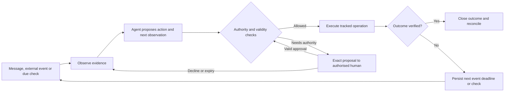

# Tarang: the end-to-end experience

**Design proposal · 1 October 2026 · Review before implementation**

User-confirmed scope: design both journeys first; use Telegram for the working
prototype; pay the ₹1,200 courier recovery automatically from an approved courier
budget. The design shows approval-led décor recovery and autonomous courier
recovery, plus an unbudgeted courier exception. ₹5,000 remains an illustrative,
configurable cap: the numeric-limit reply did not unambiguously ratify it.
All dialogue below is illustrative copy, not a transcript of a run.
Amounts and names come from the scenario materials; timings and unconfirmed
policies are explicitly identified. See [decisions](DECISIONS.md).

## 1. What a great experience means

For the newer Muskan/Om rehearsal, see the [responsibility audit](RESPONSIBILITY_AUDIT.md).
It assigns routine coordination to Tarang, preserves human decisions and physical
verification, and distinguishes the target workflow from current integration gaps.

Meera and Rohan should be able to say: “I know what Tarang is handling, I know
when it needs me, and I do not need to remember to chase it.”

Tarang brings a recommendation when a decision is required, acknowledges that
decision immediately, follows the work through, and reports completion with
evidence. Quiet operation must still be inspectable through a status request.

Proposed acceptance targets for the two rehearsals:

- Zero manual prompts to resume an open follow-up.
- Zero spending or vendor commitments outside recorded authority.
- Zero duplicate consequential actions after duplicate events or a restart.
- Every unresolved commitment has a next observation, including approval waits.
- No “done” message before the stated outcome is supported by evidence.
- The couple can understand an approval without reading the operations log.

## 2. Start with a shared understanding

Onboarding happens before the recorded recovery journeys, but is part of the
experience. Proposed path: an invite into a Telegram conversation, followed by
four short review cards. Group versus separate private chats remains undecided.

| Card | Information and supplier | What the couple reviews |
|---|---|---|
| Our wedding | Couple: date, venues, time zone, named contacts | Meera & Rohan; Jaipur; 14 December 2026; Asia/Kolkata |
| What must happen | Couple supplies planning sheets, invoices, selected chat exports; vendors confirm promises | Outcome, quantity/specification, owner, deadline, dependencies, evidence required |
| What you can decide | Couple sets spend/category budgets, booking and negotiation scope, approvers, permitted changes | Explicit authority, remaining budget, one-time exceptions, who may approve |
| How you will keep watch | Couple and vendors agree checkpoints; couple selects notification and escalation preferences | Next checks, calling windows, contact ladder, reminder limits, pause/takeover |

Inputs are extracted into a draft with source references. Missing fields remain
unknown. Conflicting dates or amounts need reconciliation; importing a document
does not establish authority. Activate only commitments with sufficient context;
show incomplete ones as “Needs setup.” No automatic access to personal WhatsApp
groups is assumed. Confirm permission to use contact details and source material.

**Illustrative activation copy**

> I’m watching the mandap setup and 200 return-gift hampers. I’ll follow up with
> your vendors and bring you a recommendation if a decision exceeds my limits.
> You can ask “What needs me?” or “What happens next?” at any time.

Controls: **Review plan**, **Review authority**, **Start monitoring**. The review
must show actual limits and next checkpoints before activation, not just this
short confirmation message. Contact identities and approvers must be verified.

## 3. A consistent conversation contract

| Moment | Couple experience | Tarang responsibility |
|---|---|---|
| Asked for status | A direct, evidence-qualified answer and next check | Reuse existing evidence; refresh when stale; avoid a second parallel recovery |
| Recovering within authority | Usually quiet; visible in status | Investigate, compare permitted options, act, schedule verification |
| Needs a decision | Problem → recommendation → cost/scope → deadline → consequence | Do research first; distinguish availability from an actual reservation |
| Decision received | “Approved by Rohan. I’m confirming the booking.” | Record exact scope atomically; acknowledge quickly; dispatch separately |
| Recovery secured | “Replacement confirmed. Setup is still being tracked.” | Close the recovery issue, keep the fulfilment commitment open |
| Outcome verified | Outcome + evidence + spend status + remaining work | Close only the verified outcome; keep unresolved finance separate |
| Cannot recover | Honest failure, latest evidence, feasible options | Notify before the deadline where possible; keep an explicit handoff/check |

Use three concepts in couple-facing language: **I’m handling it**, **Needs your
decision**, **Verified complete**. “At risk” is an outcome condition, not an
instruction to the couple. Do not send every retry or internal status transition.
Do send a material change, a requested answer, or a decision needed by a deadline.

### Approval interaction

An approval identifies vendor/payee, amount and currency, category, what action
is authorised, specification/version, deadline, and expiry. **Approve exact
action**, **See details**, **Decline**. Approving a booking is not automatically
authorising a payout or unrelated future spending.

- Validate the Telegram sender against the configured approvers, the wedding,
  the proposal version, its expiry, and its still-pending state.
- A free-text “yes” is only usable when unambiguously tied to one exact proposal;
  otherwise present a confirmation card. No broad delegation from vague assent.
- Duplicate clicks and concurrent replies consume the approval once. A changed
  quote, recipient, or material specification requires a new proposal.
- “Decline” stops that proposed action and resumes permitted option search. It
  does not cancel the wedding commitment or approve a more expensive substitute.
- An unanswered request gets configured reminders. At expiry it becomes invalid;
  contact another approver only if that person was explicitly authorised.
- A pause stops new side effects and reports what is already in flight. A human
  takeover names an owner and handoff checkpoint; it is not verified completion.

These are proposed application controls. Telegram supplies inline callbacks,
sender identity, and acknowledgement; the application must implement authority.
[Telegram Bot API](https://core.telegram.org/bots/api#callbackquery).

## 4. Journey A: décor collapse

**Start:** Rohan asks on 11 December whether décor is on track.
**Accountable outcome:** approved mandap design physically ready at the venue
by its confirmed setup deadline. The source example uses 14 December, 08:00 IST;
retain that as a proposed fixture until the event plan confirms it.

| Step | Couple sees or does | Tarang does | Evidence and next observation |
|---|---|---|---|
| A1 · Ask | “Is the mandap décor moving smoothly?” → “I’m checking with Suresh and will update you once I have confirmation.” | Reuse the décor commitment; inspect last confirmation and dependencies | Create a call operation and response deadline |
| A2 · Investigate | No stream of retry messages | Call Suresh; on no answer schedule bounded backoff; then use the authorised alternate contact | Retain actual no-answer and assistant response; mark vendor unavailable only when supported |
| A3 · Find a replacement | No decision required yet | Contact the pre-approved shortlist; confirm specs, availability, total price, terms, setup deadline and quote validity | A quote is not a booking. Hold/confirm only if authorised; compare feasible options |
| A4 · Ask once | “Suresh can’t fulfil the booking. Petal Inn can deliver the agreed design for ₹40,000. Approve the replacement booking?” | Show why this option, known terms, any unknown extras, decision deadline, and spending rule | WAITING_FOR_APPROVAL with expiry and reminder; no booking or payout before scope allows it |
| A5 · Secure recovery | Approval acknowledgement; then a factual booking update | Confirm Petal Inn after valid approval; negotiate a ₹3,000 surcharge to ₹2,500 if it arises | Check additional-spend delegation and remaining budget; payment success and vendor acknowledgement are separate evidence |
| A6 · Keep watching | “Petal Inn is confirmed. Delivery surcharge: ₹2,500 paid. I’m still tracking setup and venue access.” | Schedule materials, arrival and setup checks against the event plan; verify original-vendor cancellation/deposit obligations separately | Recovery issue can be resolved; mandap outcome remains open; record next check |
| A7 · Verify at venue | “The venue contact has confirmed the mandap is ready against your agreed plan.” | Obtain evidence from the designated verifier, scoped to venue, design/version and deadline; investigate discrepancies | Close mandap outcome only after sufficient evidence; reconcile outstanding payments/refunds separately |

**Vendor conversation surfaces, proposed scripts**

1. Primary: “I’m Tarang, coordinating Meera and Rohan’s wedding. Can you confirm
   the mandap plan, arrival time and setup deadline? Is anything preventing delivery?”
2. Alternate: “We haven’t reached Suresh. Can your team fulfil the agreed booking?
   If not, when can you confirm the handover and outstanding obligations?”
3. Backup: “Can you fulfil this exact plan by the setup deadline? Please confirm
   availability, all-inclusive price, delivery charges, payment terms and quote expiry.”
4. Negotiation: “Your additional delivery quote is ₹3,000. Can you do ₹2,500
   without changing the agreed design, timing or scope?”
5. Venue verifier: “Please confirm the mandap is ready against the attached agreed
   plan. If anything is missing, tell me what remains and the expected finish time.”

Send only necessary information; medical details are not needed in the couple's
recovery message. Do not treat an uncertain transcript as a confirmed cancellation.

### The surcharge must be a real authority demonstration

The ₹40,000 booking approval does **not** create an unlimited décor budget. The
intended no-second-approval path requires a previously granted ancillary-spend
scope, an approved category with enough remaining room, and a charge within the
transaction cap. If any are missing, show a new decision. Do not split an expense
to evade the cap. The fixture must record whether ₹40,000 is only committed, partly
paid, or fully paid; only the ₹2,500 payout is specified by the existing story.

## 5. Journey B: the vendor's courier fails

**Start:** a dispatch checkpoint passes without evidence on 12 December.
**Accountable outcome:** all 200 hampers received in acceptable condition at the
correct venue by the agreed deadline. Source fixture: delivery by 18:00 IST;
dispatch expected 11:00 plus 15-minute grace, detected on the next heartbeat.
These checkpoint values are proposals, not ratified policy. A check at 11:40
must disclose scheduler delay or have its own agreed check-in; do not hide the gap.

| Step | Couple sees or does | Tarang does | Evidence and next observation |
|---|---|---|---|
| B1 · Notice absence | No reminder needed from the couple | Persist the dispatch expectation, compare observed evidence after grace, enqueue one investigation | Absence means unverified dispatch, not proof of courier failure |
| B2 · Investigate | Quiet investigation | Call Anand Gifts; establish what is packed, what failed, location, package count/dimensions/weight and readiness | Actual vendor response supports “courier unavailable; nothing shipped”; otherwise clarify |
| B3 · Find a feasible route | Quiet option search | Check pickup/serviceability, readiness, costs and supported delivery commitment; compare approved alternatives | Jaipur-local shop, ₹1,200 cost and same-day availability remain scenario assumptions until supported |
| B4 · Check authority | No approval request in the canonical journey | Check the ₹1,200 amount against the configured cap, approved courier budget, remaining room, exact payee and permitted booking/payment scope | Proceed autonomously only if all checks pass; a missing budget routes to the exception branch |
| B5 · Arrange fulfilment | “The original courier fell through. I’ve arranged replacement pickup for ₹1,200 within your courier budget. I’m tracking delivery.” only once those facts are confirmed | Revalidate quote; follow the documented payment/manifest/pickup order; ensure labels, packaging and vendor handover | Track payment, shipment and pickup IDs separately; each accepted request gets a watchdog |
| B6 · Track and recover | A material delay notice only when useful | Observe pickup and transit; chase stalled shipment; evaluate alternatives within scope | Booking/pickup/in-transit are not delivery; the same commitment owns all follow-ups |
| B7 · Verify receipt | “The venue contact confirmed all 200 hampers arrived in good condition. Courier payment: ₹1,200 successful.” only when both facts are evidenced | Correlate all package IDs, carrier event and designated recipient's quantity/condition confirmation | A missing/damaged hamper keeps the shortfall open; reconcile payment separately |

**Exception variant: courier category was never authorised.** Same recovery,
different authority state. Before spending or chargeable booking, ask: “Your
200 hampers haven’t left Anand Gifts. The available recovery option costs ₹1,200.
This category isn’t in your approved budget. Approve this one-time courier
expense?” Include exact payee, window, terms and expiry in the details. This
variant demonstrates the category rule without altering the approved-budget
canonical journey. After valid approval, return to B5; decline or silence follows
the failure table. Neither the ₹1,200 fixture nor a budget guarantees service.

**Vendor / recipient surfaces, proposed scripts**

- Shop: “Have all 200 hampers left for the venue? If yes, share the dispatch
  reference. If not, what is preventing pickup and when will every package be ready?”
- Readiness: “Please confirm package count, dimensions, weight, pickup address,
  contact and readiness. I’ll share confirmed shipping labels and handover details.”
- Venue: “The carrier reports delivery. Please confirm how many hampers arrived,
  whether they are in good condition, and any missing packages.”

### Feasibility constraint

Delhivery documents shipment creation, tracking, cost calculation and pickup
requests. Its pickup guide requires an order to be booked and packages labelled
and ready before pickup. Neither establishes that a Jaipur same-day rescue for
200 hampers at ₹1,200 is available. Route travel time is not a delivery SLA.
If the deadline cannot be met, present a feasible alternative or report the gap;
do not manufacture a same-day response for the recording.
[API catalogue](https://help.delhivery.com/home/docs/client-developer-portal-1),
[pickup preparation](https://help.delhivery.com/docs/pickup-request).

## 6. The difficult moments are part of the experience

| Condition | Behaviour | Couple-facing copy pattern | Next observation |
|---|---|---|---|
| Vendor does not answer | Bounded retry, then authorised alternate/backup; no repeated calls forever | “I haven’t reached the vendor. I’m checking the agreed backups.” only when material | Retry time or backup response deadline |
| Approval unanswered | Remind within configured cadence; expire on deadline; no spending by silence | “The option expires at [time]. I need your decision to proceed; otherwise I’ll recheck availability.” | Reminder, expiry, then renewed option search |
| Approval declined | Cancel that proposal; preserve outcome and inspect alternatives | “I won’t confirm this option. I’ll check the remaining choices.” | Alternative response deadline or human handoff |
| Quote changes / approval expires | Invalidate old action scope; refresh the proposal | “The quote changed from [old] to [new]. Please review the updated option.” | New approval expiry |
| Payment pending / timeout | Mark unknown/pending, query existing operation; do not issue a fresh payout | “The payment hasn’t been confirmed yet. I’m checking its status.” | Status reconciliation deadline |
| Payment explicitly rejected | Classify cause, reconcile terminal status; retry only if safe and authorised | “Payment failed. The booking is [actual state]. I’m checking the next available payment option.” | Funding/rail check; ask if new method/authority required |
| Pickup missed / shipment stalls | Contact carrier and sender; refresh feasibility; avoid duplicate booking while prior shipment is active | “Pickup is delayed. The delivery deadline is at risk; I’m checking recovery options.” | Carrier response deadline and independent shipment check |
| Carrier says delivered, venue disputes | Preserve both sources; request package/recipient evidence; keep unresolved | “The carrier reports delivery, but the venue hasn’t verified all 200 hampers. I’m checking the shortfall.” | Venue/carrier follow-up, then replacement/claim proposal |
| Setup photo or vendor claim is incomplete | Verify against agreed specs and named venue contact | “Setup is reported complete. I’m waiting for the venue check.” | Verification deadline; remediation if discrepancy persists |
| Telegram unavailable | Persist undelivered notification, bounded retry; never assume a human received it | Visible delivery issue in operator view; only use a pre-authorised fallback channel | Retry/channel-health checkpoint |
| Agent restarts | Reload pending jobs and operation IDs, reconcile before reissuing | No duplicate prompts or confirmations | Resume due checks once; flag overdue checks |
| Deadline cannot be met | Escalate the actual impact and viable options; never relabel as success | “The original deadline cannot be met. Here are the options I can still secure.” | Named human decision or recovery checkpoint |

Declined, cancelled, handed over and failed are outcome statuses, not success.
An authorised cancellation can retire a commitment with reason and actor; the
original target stays recorded as not achieved. A handoff is complete only after
acceptance by the named owner. Hard reminder/retry values and fallback recipients
remain decisions for review; proposed rehearsal values belong in config, not copy.

## 7. One automation loop for both journeys

The runtime must persist state, operation intent, audit entry and next observation
before dispatch. Do not hold an HTTP request open while waiting for a vendor.
See [architecture](ARCHITECTURE.md) for boundaries and proposed records.

## 8. Recording and evidence design

The review HTML is a storyboard only. For the actual Round 3 simulation:

- The AI model follows the submitted system prompt and chooses each next action.
  Do not turn the storyboard into a fixed decision script.
- Gnani inputs must actually run through Gnani and its response be returned
  unchanged. The brief allows documentation-based responses for Pine Labs and
  Delhivery; each must retain its endpoint, request, response and doc reference.
- Every outside-world input needs a real source. Clearly identify actors and
  source records; rehearsal fixtures are not live wedding evidence. Do not pass
  off an invented clock, receipt, dispatch event or photo as a real input.
- Show all received events, relevant rail calls and responses, outgoing messages,
  decisions, policy checks, results, and next checks. Log concise decision reasons,
  not hidden model reasoning.
- A 5-minute recording may fast-forward model thinking. Whether compressed
  scenario dates or other time jumps are acceptable remains unconfirmed. Preserve
  actual capture time separately from scenario time; do not claim physical setup
  or delivery happened merely because a simulated date advanced.

**Recommended recording choice, not decided:** record one complete primary
journey (courier covers all three rails) and retain décor as a second rehearsal.
Trying to squeeze both into five minutes risks cutting required evidence. Design
both now; select the final recording only after supported rail behaviour is known.

## 9. Review checklist before implementation

1. Ratify the authority details in the decision register, including ancillary
   décor scope, category room, approvers, revocation and one-time exceptions.
2. Confirm origin/address, shipment shape and delivery feasibility; obtain exact
   rail payloads and access. Decide payment terms/payee and who verifies outcomes.
3. Set retry/contact, approval-reminder and escalation policies; calling windows;
   notification preferences; quote expiries supplied by sources where available.
4. Choose model and persistable runtime; write the system prompt against this
   contract, then run behavioural and failure-path tests.
5. Walk through onboarding, approval, decline, silence, pending payment, disputed
   delivery and restart; observe whether the couple ever has to remember a follow-up.

## Sources and provenance

Source materials remain unchanged in `resources/`:

- [Round 3 brief](../resources/You're%20shortlisted%20to%20Round%203%20of%20The%20Ken’s%20Case-Build%20Competition.pdf), pages 1–2: simulation, recording, source and deliverable rules.
- [Submitted Round 2 answers](../resources/The-Ken-Case-Competition-Round-2-answers.docx): L3 authority, lifecycle, product interface and intended rails.
- [Agent build context](../resources/context/TARANG_AGENT_CONTEXT.md): scenarios, commitments, watchdogs and invariants.
- [Historical SSOT](../resources/context/Tarang_SSOT.md): conflicting assumptions and open decisions.

Official documentation inspected 1 October 2026: Telegram callback handling;
Delhivery API catalogue and pickup preparation (linked above);
[Gnani speech APIs](https://docs.gnani.ai/api/introduction/introduction) and
[agent platform](https://docs.gnani.ai/Platform/platform-introduction);
[Pine Labs developer portal](https://www.pinelabs.com/docs).
This is a bounded feasibility review, not completed endpoint validation or an
assertion that accounts, credentials or production capabilities are available.
